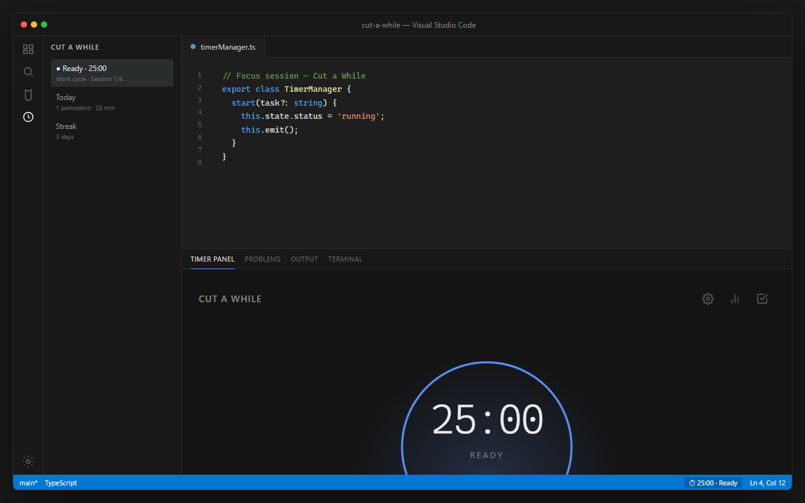

# Cut a While

**Pomodoro for VS Code** — stay in flow without leaving the editor.

[](https://marketplace.visualstudio.com/items?itemName=horaciodominguez.cut-a-while)
[](https://open-vsx.org/extension/horaciodominguez/cut-a-while)



A minimal focus timer that lives inside VS Code: status bar countdown, activity-bar tree, and a clean webview panel that follows your editor theme.

---

## Why

External timers break concentration. Cut a While keeps work / break cycles, tasks, and light analytics next to your code — with optional Zen Mode when you need fewer distractions.

## Features

- **Pomodoro cycles** — work, short break, and long break (defaults 25 / 5 / 15)
- **Status bar** — live countdown; click to open the panel
- **Timer panel** — editorial UI with progress arc, session dots, and streak
- **Tasks** — quick chips and a todo drawer tied to your focus sessions
- **Stats** — today / week / totals, 7-day chart, top tasks, project focus time
- **Sounds** — six completion themes (bell, digital, nature, zen, soft, classic)
- **Accent color** — blue, purple, green, pink, orange, or teal
- **Zen Mode** — optional full focus when a work session starts
- **Auto-pause** — pause when VS Code loses window focus; prompt to resume
- **Focus tracking** — hover a file to see accumulated focus time; project totals in stats
- **Persistent state** — timer progress survives window reloads

## Install

### VS Code Marketplace

Search **Cut a While** in the Extensions view, or install from the [Marketplace listing](https://marketplace.visualstudio.com/items?itemName=horaciodominguez.cut-a-while).

### Open VSX (Cursor / VSCodium / Antigravity)

Search **Cut a While** in Extensions, install by ID `horaciodominguez.cut-a-while`, or use the [Open VSX listing](https://open-vsx.org/extension/horaciodominguez/cut-a-while).

### GitHub Release (`.vsix`)

Download `cut-a-while-0.1.2.vsix` from the [latest GitHub Release](https://github.com/horaciodominguez/cut-a-while/releases/latest), then in VS Code: **Extensions → … → Install from VSIX…**

### From source

```bash
npm install
npm run build
npm run package
```

Then install the generated `cut-a-while-0.1.2.vsix` as above, or press **F5** after `npm run build` to run an Extension Development Host.

## Usage

1. Open the **Cut a While** icon in the Activity Bar, or the **Timer Panel** in the bottom panel.
2. Optionally type what you’re working on.
3. Press **Start**, or use the shortcut below.
4. When the cycle ends, take your break — or skip it from the panel.

### Commands

| Command | Default shortcut |
|---------|------------------|
| **Cut a While: Start / Pause Timer** | `Ctrl+Shift+T` (when not typing in an editor) |
| **Cut a While: Show Timer Panel** | — |
| **Cut a While: Reset Timer** | — |
| **Cut a While: Show Statistics** | — |

Open the Command Palette (`Ctrl+Shift+P` / `Cmd+Shift+P`) and type `Cut a While`.

## Settings

Search **Cut a While** in Settings, or edit `settings.json`:

| Setting | Default | Description |
|---------|---------|-------------|
| `cut-a-while.workDuration` | `25` | Work session length (minutes) |
| `cut-a-while.breakDuration` | `5` | Short break (minutes) |
| `cut-a-while.longBreakDuration` | `15` | Long break (minutes) |
| `cut-a-while.longBreakInterval` | `4` | Work sessions before a long break |
| `cut-a-while.autoStart` | `true` | Auto-start the next cycle when one ends |
| `cut-a-while.autoPause` | `true` | Pause when VS Code loses window focus |
| `cut-a-while.sound.enabled` | `true` | Play a sound when a cycle completes |
| `cut-a-while.soundTheme` | `bell` | `bell` \| `digital` \| `nature` \| `zen` \| `soft` \| `classic` |
| `cut-a-while.zenMode` | `false` | Enter Zen Mode on focus start (exits on pause/break) |
| `cut-a-while.statusBarAlignment` | `right` | `left` \| `right` |
| `cut-a-while.theme.accent` | `blue` | Accent for ring, CTA, and UI accents |

Most of these are also editable from the in-panel **Settings** drawer.

## Architecture

```
Extension Host (Node)          Webview (React + Vite)
┌─────────────────────┐        ┌──────────────────────┐
│ TimerManager        │◄──────►│ Timer panel UI       │
│ Storage (globalState│  msgs  │ Settings / Stats /   │
│ Status bar + Tree   │        │ Tasks drawers        │
│ Zen / auto-pause    │        └──────────────────────┘
│ File / project focus│
└─────────────────────┘
```

- **Host:** TypeScript, VS Code Extension API  
- **UI:** React 19, Tailwind CSS 4, Framer Motion (drawers)  
- **Build:** `tsc` → `out/extension.js`; Vite → `out/webview/`

## Development

Requirements: Node.js 20+, VS Code / Cursor with extension debugging.

```bash
npm install
npm run build      # compile extension + webview
npm run dev        # watch both
npm test           # Vitest (timer, storage, time utils)
npm run lint
npm run package    # produce .vsix via vsce
```

**Publish to Open VSX** (after `npm run package`):

```bash
npm run publish:openvsx -- -p <TOKEN>
```

Token at [open-vsx.org/user-settings/tokens](https://open-vsx.org/user-settings/tokens).

**Debug:** open this folder in VS Code → **Run and Debug** → **Run Extension** (or **F5**). A second window (**Extension Development Host**) loads the extension.

Tip: after UI changes, rebuild the webview (`npm run build:webview` or `npm run dev`) and reload the Extension Development Host.

## License

MIT — see [LICENSE](LICENSE). Publisher: [horaciodominguez](https://marketplace.visualstudio.com/publishers/horaciodominguez).
